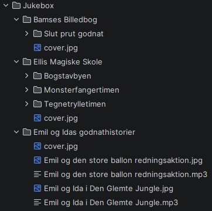
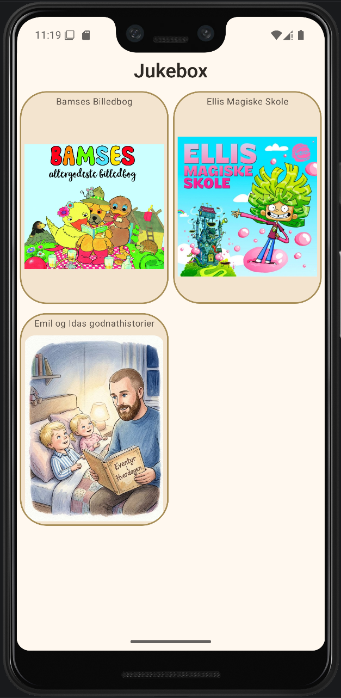
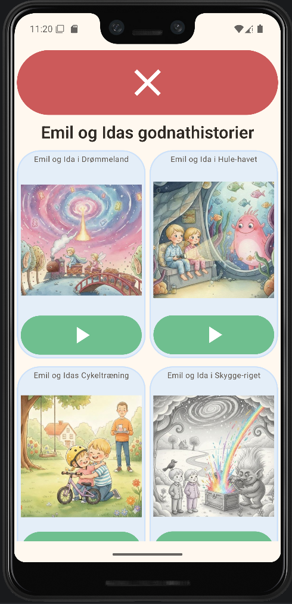
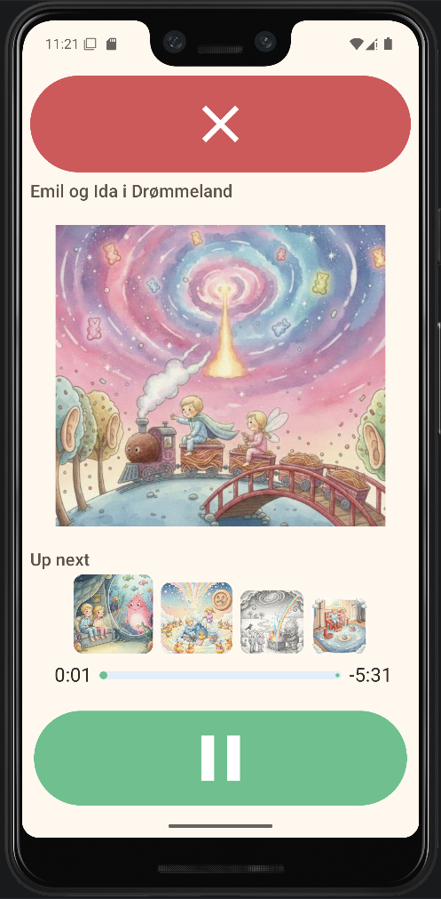

# MyKidsJukebox

**MyKidsJukebox** is a visual-first Android app for browsing and playing your child’s audiobooks. Stories appear as large cover cards so a pre-reader can pick what to hear without reading titles on a traditional file list.

This repository contains the Android app (Kotlin + Jetpack Compose). Product goals and backlog items live in [SRS.md](SRS.md). Code layout and data flow are summarized in [Architecture.md](Architecture.md). Though, these files are probably outdated and has degrated to a messy collection of notes and ideas.

The idea is heavily inspired by YouTube Kids, but with a focus on audiobooks and a simpler UI.

---

## Who it is for

Toddlers and young children who benefit from **big touch targets**, **minimal text**, and **folder + cover** navigation instead of tiny lists. Parents curate a library of MP3s (and optional artwork) on the device, so there is a bit of manual work involved. You can use Android **screen pinning** if you want the device to stay inside this app during listening time (ideally, though it doesn't seem to work on my Samsung S8).

---

## Features

- **Local library only** — No accounts, no cloud; files stay on your phone or tablet.
- **Storage Access Framework (SAF)** — You choose one **root library folder**; the app keeps read access across restarts (until Android revokes it or the folder is removed).
- **Nested folders** — Organize series or authors as subfolders; open a folder by tapping its card.
- **Optional artwork** — Folder `cover.jpg` and per-track JPGs next to each MP3.
- **Playback** — Media3-based playback with a foreground service so audio can continue with the screen off (subject to device and battery settings).
- **Queue** — Stories in the current folder play in **A–Z order** (by filename, case-insensitive); the player shows **Up next** so you can jump ahead.


---

## Screenshots

### Example file structure

First, here is an example of the file structure, you are supposed to follow:



Each folder can contain an optional "cover.jpg" image, which will be displayed on the folder card.

Each mp3 file can have an optional jpg file with the exact same name, but with a .jpg extension. This will be displayed on the audio card. The location of the jpg file is the same as the mp3 file.

### Library view

The app will scan the folders in the selected root folder and build a grid of cards:



### List of audio files

When navigating into a folder, which contains audio files, the app will show a list of audio file cards. These have a play button:



The big red button is to "go back".

Clicking a green play button will open the player screen, which will play the audio file, and queue up subsequent audio files in alphabetical order.

### Player screen

Here is the player screen:



- The red button stops the track and returns to the list of audio files.
- The artkwork (if present) is displayed in the center of the screen.
- Below is the queue of upcoming audio files. The user can click these to images to play the audio file. The queue will update.
- The progress bar shows the progress of the current track. This is not interactive, it is just a visual indication of the progress.
- The green button will play/pause the current track.


## Requirements

- **Android 8.0 (API 26) or newer** — See `minSdk` in [App/app/build.gradle.kts](App/app/build.gradle.kts).
- A place to store files that you can reach with the system **Files** app or your computer when copying audiobooks (for example **Documents** or **Downloads**, or an SD card).

---

## For parents: Install the app

1. **From Android Studio (development)** — Open the `App` folder as a Gradle project, connect a device or start an emulator, choose the **app** run configuration, then click Run.
2. **From an APK** — Build a debug or release APK in Android Studio (**Build → Build Bundle(s) / APK(s)**), copy the APK to the phone, and install it (you may need to allow installs from that source).

---

## For parents: Put audiobooks on the phone

1. Create a **single top-level folder** that will be your “library root” (for example `Audiobooks` or `MyKidsJukebox`).
2. Copy that folder onto the device using **USB**, **Google Drive**, **Nearby Share**, or any method you already use. Prefer locations the **Files** app can open, such as **Documents** or **Downloads** or **Music**, so the system folder picker can grant access.
3. Inside that root, add **subfolders** and **MP3 files** as described previously.

Avoid relying on folders that only another app’s private storage can see, unless you know that app exposes them through the system picker.

---

## For parents: Choose the library folder in the app

The first time you open the app (or if the saved folder is no longer valid), you will see **Choose your story library folder to begin** and a button like **Choose Library Folder**.

1. Tap **Choose Library Folder**.
2. In the system picker, select the **same root folder** you created for audiobooks (not an arbitrary parent of many unrelated trees, unless that is what you want the child to see).
3. Android may ask you to **allow access**; accept so the app can read that tree.

The app stores the choice in **DataStore** and requests a **persistent** read permission. If access is lost, you may see *Could not keep access to this folder. Please choose it again.* — pick the folder again, or clear the app’s storage and start over.

**Changing the library root today:** There is no in-app “change library” screen yet. To point at a different folder, use **Settings → Apps → MyKidsJukebox → Storage / Clear data** (wording varies by device), then open the app and select the new root. I should probably add an option for this later, I do have thoughts about some kind of parental settings screen. Eventually, maybe. We'll see.

---

## Library structure and naming

These rules match how the app scans the filesystem in [`LibraryScanner.kt`](App/app/src/main/java/pastimegames/mykidsjukebox/data/library/LibraryScanner.kt).

### Folders and hierarchy

- The **folder you pick in the picker** is the **library root**.
- You may use **any depth** of subfolders. Each folder can contain more **subfolders**, **MP3** files, **JPG** images.
- You should not mix audio files and folders under the same parent folder. Behaviour for this is not tested. That means a folder can contain either:
  - Only audio files, their artwork, and the cover.jpg image.
  - Only folders, and the cover.jpg image.
- **Folder name** is whatever appears in the file manager; that name is shown on the card (with minor system variations).

### Audio files

- **Format:** **`.mp3` only** in the current version. Other extensions are ignored for playback.
- **Display title:** The file name **without** `.mp3`.
- **Play order:** All MP3s in the **current** folder are sorted **alphabetically** by that title (case-insensitive) when you start playback from one of them.

### Folder cover artwork

- Put a file named **`cover.jpg`** inside a folder to use it as that folder’s cover in the grid.
- The name is matched case-insensitively (`cover.jpg`, `Cover.JPG`, etc.).
- Do note .jpeg files are ignored.

### Per-track artwork (optional)

- For a track `Story Name.mp3`, you may add **`Story Name.jpg`** in the **same folder** (same base name, `.jpg` extension). Case-insensitive matching is used for the extension and for pairing names.

### Example layout

```text
Audiobooks/                    ← select this folder in the app
  cover.jpg                    ← optional: art for this root level
  The Big Adventure/
    cover.jpg
    01 Opening.mp3
    01 Opening.jpg             ← optional: art for this track
    02 The Forest.mp3
    02 The Forest.jpg
  Bedtime Songs/
    cover.jpg
    lullaby-01.mp3
```

---

## How your child uses the app

1. Open **MyKidsJukebox**.
2. **Library** shows a grid of **folders** and **story** cards for the current location. 
3. Tap a **folder** card to **go inside** that folder.
4. When a **back** control appears (large control at the top), tap it to **go up** one level.
5. For a **story** (MP3), tap the **Play** button on the card to open the **player**. Tapping the folder-style navigation is for folders; playback starts from the Play control on audio cards.
6. In the **player**, use **play / pause**, pick another upcoming story from **Up next** if shown, and use the **large close** control to return to the library.

---

## For developers

- Open the **[App](App)** directory in Android Studio as the Gradle project root.
- **JDK 11** — `compileOptions` in `App/app/build.gradle.kts` target Java 11.
- Run configuration: module **app**, apply changes as usual for Compose.
- Scanner behavior is covered by unit tests in [`LibraryScannerTest.kt`](App/app/src/test/java/pastimegames/mykidsjukebox/data/library/LibraryScannerTest.kt).

For module layout, navigation, and SAF details, see [Architecture.md](Architecture.md).

---

## Privacy

The app reads **only the audio library folder you select**. It does not require a login and does not upload your files by itself.
